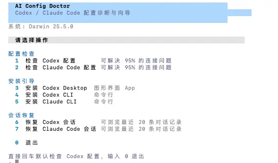

<div align="center">

# 🩺 AI Config Doctor

**Codex / Claude Code 第三方 API 配置诊断与向导工具**

简体中文 · [English](./README.md)

面向非技术用户，帮助快速完成 [Codex](https://codex.com) 和 [Claude Code](https://claude.ai/code) 的第三方 API 接入，一键检查、修复、安装、恢复会话。

[](#快速开始)
[](https://www.python.org/)
[](#license)
[](https://docode.cc)

</div>

---

## ✨ 功能特性

| 功能 | 说明 |
|------|------|
| 🔍 **配置检查** | 自动验证 `base_url`、API Key、模型等关键字段，精确定位问题 |
| 🛠️ **配置向导** | 逐步引导填写 API 地址和 Key，自动写入配置文件，支持拉取模型列表选择 |
| 📦 **安装引导** | 检测环境、自动安装 Node.js 和 CLI 工具（支持 brew / winget / apt 等） |
| 🔁 **会话恢复** | 扫描本地会话记录，展示摘要，一键生成或执行恢复命令 |

---

## 📸 截图



---

## 🚀 快速开始

### 方式一：下载预编译版本（推荐，无需安装 Python）

前往 [Releases](../../releases) 页面，下载对应平台的可执行文件：

| 平台 | 文件名 |
|------|--------|
| macOS Apple Silicon | `ai-config-doctor-vX.Y.Z-macos-arm64.pkg` |
| macOS Intel | `ai-config-doctor-vX.Y.Z-macos-x64.pkg` |
| Windows x64 | `ai-config-doctor-vX.Y.Z-windows-x64.exe` |
| Linux x64 | `ai-config-doctor-vX.Y.Z-linux-x64` |
| Linux x64 Debian/Ubuntu | `ai-config-doctor-vX.Y.Z-linux-x64.deb` |

**macOS：**

下载 `.pkg` 安装包并双击安装。安装完成后，可以在终端运行 `ai-config-doctor`，也可以打开 `/Applications/AI Config Doctor.app` 或 `/Applications/AI Config Doctor.command`。

如果 macOS 提示来自互联网无法打开，请右键 `.pkg` 文件并选择“打开”。

**Linux：**
Debian / Ubuntu / Linux Mint 用户可以安装 `.deb`：

```bash
sudo dpkg -i ai-config-doctor-vX.Y.Z-linux-x64.deb
ai-config-doctor
```

也可以直接运行独立二进制：

```bash
chmod +x ai-config-doctor-vX.Y.Z-linux-x64
./ai-config-doctor-vX.Y.Z-linux-x64
```

**Windows：**
双击 `ai-config-doctor-vX.Y.Z-windows-x64.exe` 直接运行。

---

### 方式二：源码运行

需要 Python 3.8+，无任何第三方依赖。

```bash
git clone https://github.com/docodecc/AI-Config-Doctor.git
cd AI-Config-Doctor
python3 check_codex.py
```

---

## 📋 菜单说明

```
请选择操作  （输入数字后回车，直接回车默认检查 Codex 配置）

  配置检查
    1  检查 Codex 配置        可解决 95% 的连接问题
    2  检查 Claude Code 配置  可解决 95% 的连接问题

  安装引导
    3  安装 Codex Desktop（图形界面 App）
    4  安装 Codex CLI（命令行）
    5  安装 Claude CLI（命令行）

  会话恢复
    6  恢复 Codex 会话       可浏览最近 20 条对话记录
    7  恢复 Claude Code 会话 可浏览最近 20 条对话记录

    0  退出
```

---

## 🔎 检查项说明

### Codex（`~/.codex/`）

| 文件 | 检查项 |
|------|--------|
| `config.toml` | 是否存在 · `base_url` 格式是否正确 · `model` 是否设置 |
| `auth.json` | 是否存在 · `OPENAI_API_KEY` 是否非空且长度合理 |

### Claude Code（`~/.claude/`）

| 文件 | 检查项 |
|------|--------|
| `settings.json` | `ANTHROPIC_AUTH_TOKEN` · `ANTHROPIC_BASE_URL` · `ANTHROPIC_MODEL` · `ANTHROPIC_SMALL_FAST_MODEL` |

---

## 🧭 配置向导

检查完成后可进入配置操作菜单，支持 4 种粒度：

```
  1  全部更改（API 地址、Key/Token 和模型）
  2  只更改 URL
  3  只更改 Key/Token
  4  获取最新模型并选择
  0  返回主菜单
```

- API 地址不能填写 `localhost`、`127.0.0.1`、局域网 IP 等本地地址，工具会自动检测并提示修改
- Claude Code 需分别配置主模型（`ANTHROPIC_MODEL`，建议 Sonnet/Opus）和快速模型（`ANTHROPIC_SMALL_FAST_MODEL`，建议 Haiku）
- 当 API 地址和 Key 均有效时，工具会自动尝试拉取模型列表（兼容 OpenAI 风格和 Anthropic 风格接口）

---

## 📦 安装引导

选择 `3` / `4` / `5` 进入安装引导：

1. 检测目标工具是否已安装
2. 检测 Node.js / npm 是否可用
3. **如未安装 Node.js，自动尝试通过系统包管理器安装：**
   - macOS：`brew install node`
   - Windows：`winget install OpenJS.NodeJS.LTS`
   - Linux：`apt-get` / `dnf` / `yum` / `pacman`（按顺序检测）
4. 执行 `npm install -g <工具包名>`
5. 安装完成后直接进入配置向导，无需手动运行工具再退出

---

## 🔁 会话恢复

- **Codex**：扫描 `~/.codex/sessions` 和 `~/.codex/archived_sessions`，恢复命令：`codex resume <session_id>`
- **Claude Code**：扫描 `~/.claude/projects`，恢复命令：`claude --resume <session_id>`

展示最近 20 条会话的时间、项目路径和摘要，选择后可直接在当前终端执行恢复命令，CLI 会在对应的项目目录下启动并承接历史对话。若项目目录已不存在，工具会给出警告并在当前目录执行。

---

## 🗂️ 配置文件格式

**`~/.codex/config.toml`**
```toml
model_provider = "custom"
model = "gpt-4.1"

[model_providers.custom]
name = "custom"
base_url = "https://your-api.com/v1"
wire_api = "responses"
requires_openai_auth = true
```

**`~/.codex/auth.json`**
```json
{
  "OPENAI_API_KEY": "sk-xxxxxxxxxxxxxxxx"
}
```

**`~/.claude/settings.json`**
```json
{
  "env": {
    "ANTHROPIC_AUTH_TOKEN": "sk-ant-xxxxxxxxxxxxxxxx",
    "ANTHROPIC_BASE_URL": "https://your-api.com",
    "ANTHROPIC_MODEL": "claude-sonnet-4-5",
    "ANTHROPIC_SMALL_FAST_MODEL": "claude-haiku-4-5"
  }
}
```

---

## 🌐 语言

AI Config Doctor 会自动跟随系统语言：中文系统显示简体中文，其他语言默认显示英文。也可以手动指定：

```bash
AI_CONFIG_DOCTOR_LANG=en python3 check_codex.py   # 强制英文
AI_CONFIG_DOCTOR_LANG=zh python3 check_codex.py   # 强制中文
```

---

## ⚙️ 主题配色

终端配色自动适配浅色/深色背景，也可手动指定：

```bash
AI_CONFIG_DOCTOR_THEME=light python3 check_codex.py   # 强制浅色
AI_CONFIG_DOCTOR_THEME=dark  python3 check_codex.py   # 强制深色
```

---

## 🔧 自行打包

```bash
pip install pyinstaller
pyinstaller --onefile --name "ai-config-doctor" check_codex.py
# 产物在 dist/ 目录
```

> ⚠️ PyInstaller 打包的二进制文件**只能在打包时所在的平台运行**，不同平台需分别打包。

---

## 🛠️ 技术说明

- **Python 3.8+，零外部依赖**（仅标准库）
- 自实现轻量 TOML 解析器，支持 `[section.subsection]` 嵌套
- 跨平台 ANSI 颜色（Windows 通过 `os.system("")` 启用）
- 模型接口兼容 OpenAI Bearer 和 Anthropic x-api-key 两种认证风格，自动探测常见路径
- 每次操作完成后提示"按回车键返回主菜单"，返回时自动清屏，界面始终保持整洁

---

## ⚖️ License 与免责声明

本项目采用 [MIT License](./LICENSE) 开源。你可以自由使用、复制、修改、合并、发布、分发、再授权或销售本软件副本，但需要在软件副本或主要部分中保留版权声明和许可声明。

### 免责声明

- 本工具按“现状”提供，不作任何明示或暗示的保证。
- 使用本工具产生的任何后果（包括配置错误、数据丢失、账号限制等）由使用者自行承担。
- 本工具不存储、不上传 API Key 或用户会话数据，所有配置仅写入本机文件。
- 本工具不是 OpenAI、Anthropic、Codex 或 Claude Code 的官方产品。

### 署名建议

如果你在自己的项目、文章或教程中引用本工具，欢迎注明：

```text
AI Config Doctor by docode.cc
```

---

## License

MIT © [docode.cc](https://docode.cc)

---

<div align="center">

**AI Config Doctor 由 [docode.cc](https://docode.cc) 出品**

如有问题或建议，欢迎提交 Issue 或访问 [docode.cc](https://docode.cc) 联系作者。

</div>
